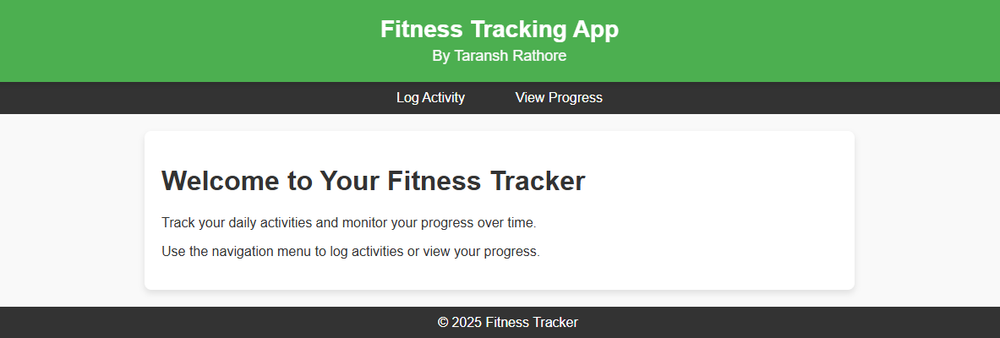
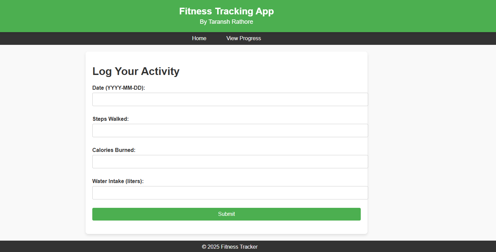
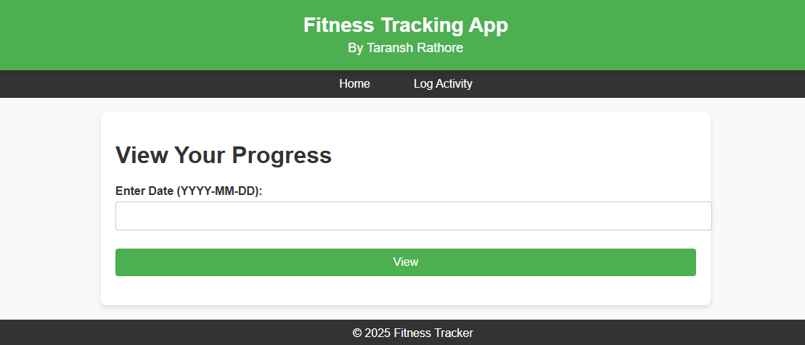

# Fitness Tracking web application


A simple and interactive web-based fitness tracking application built using Flask. Users can log their daily activities such as steps walked, calories burned, and water intake, and view their progress over time.

---

## Features

- **Log Activity:** Record daily fitness data, including steps walked, calories burned, and water intake.
- **View Progress:** Retrieve and display fitness progress for a specific date or overall summary.
- **User-Friendly Interface:** Attractive and responsive design with consistent navigation.

---

## Technologies Used

- **Backend:** Python (Flask Framework)
- **Frontend:** HTML, CSS (Custom Styles)
- **Data Storage:** Local CSV file for simplicity

---

## Installation

1. **Clone the Repository:**
   ```bash
   git clone https://github.com/yourusername/fitness-tracking-app.git
   cd fitness-tracking-app
   ```

2. **Set Up a Virtual Environment:**
   ```bash
   python -m venv venv
   source venv/bin/activate # On Windows, use `venv\Scripts\activate`
   ```

3. **Install Dependencies:**
   ```bash
   pip install -r requirements.txt
   ```

4. **Run the Application:**
   ```bash
   python app.py
   ```

5. **Access the App:**
   Open your web browser and go to `http://127.0.0.1:5000/`.

---

## Folder Structure

```
fitness-tracking-app/
├── static/
│   └── style.css          # CSS for styling the app
├── templates/
│   ├── index.html         # Home page
│   ├── log_activity.html  # Log activity page
│   └── view_progress.html # View progress page
├── app.py                 # Main Flask application
├── data.csv               # Local data storage file (auto-created)
├── requirements.txt       # Python dependencies
└── README.md              # Project documentation
```

---

## Screenshots

### Home Page


### Log Activity Page


### View Progress Page


---

## How to Use

1. **Log Your Activity:**
   - Navigate to the `Log Activity` page.
   - Fill in the form with your daily fitness data.
   - Click "Submit" to save the data.

2. **View Your Progress:**
   - Navigate to the `View Progress` page.
   - Enter a specific date (YYYY-MM-DD) or "all" to view overall progress.
   - Click "View" to see the results.

---

## Contributing

Contributions are welcome! If you would like to contribute:

1. Fork the repository.
2. Create a new branch for your feature or bugfix.
3. Commit your changes and push the branch.
4. Submit a pull request.

---

## License

This project is licensed under the [MIT License](LICENSE).

---

## Author

**Taransh Rathore**

---

## Acknowledgments

- Flask Documentation
- Online resources for CSS design inspiration
